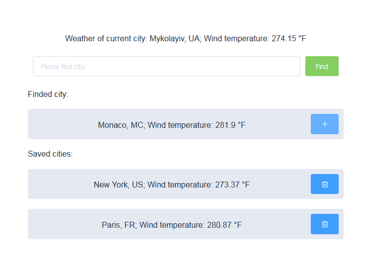

# Weather
Vue JS project is showing weather forecast.
Live demo [a link](https://yorik0512.github.io/portfolio/weather-forecast-vue-js/)

## Installation and Startup
```
npm install
npm start
```

## What it can
- Automatically find your location and show weather
- Find the weather forecast for the city of your interest
- Save city with weather forecast
- Delete city with weather forecast
